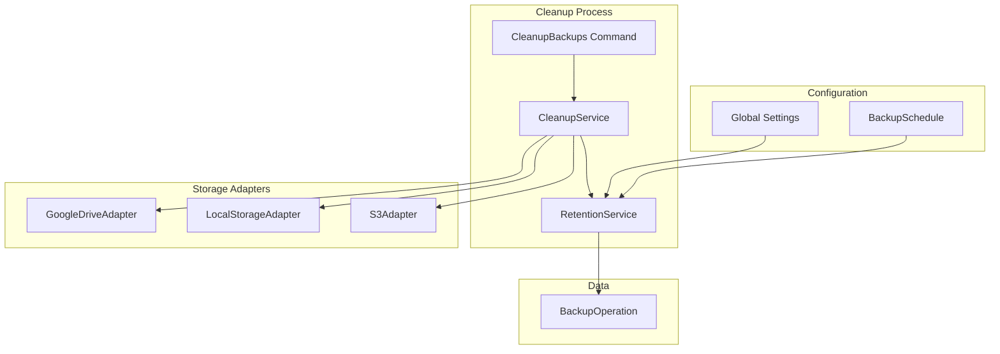

# Design Document: Backup Retention Policies

## Overview

This feature adds automatic backup retention and cleanup to prevent storage from filling up. Retention policies can be configured per schedule or as a global default. A cleanup job runs daily to identify and delete expired backups, including removing files from storage destinations.

## Architecture



## Components and Interfaces

### Database Schema

#### Add retention fields to backup_schedules

```php
Schema::table('backup_schedules', function (Blueprint $table) {
    $table->integer('retention_count')->nullable(); // Keep last N backups
    $table->integer('retention_days')->nullable();  // Keep for X days
});
```

#### Add fields to backup_operations

```php
Schema::table('backup_operations', function (Blueprint $table) {
    $table->boolean('is_protected')->default(false);
    $table->boolean('is_deleted')->default(false);
    $table->timestamp('deleted_at')->nullable();
});
```

#### Create retention_settings table (global defaults)

```php
Schema::create('retention_settings', function (Blueprint $table) {
    $table->id();
    $table->string('key')->unique();
    $table->string('value')->nullable();
    $table->timestamps();
});
```

### Backend Components

#### 1. RetentionService

```php
<?php

namespace App\Services;

use App\Models\BackupOperation;
use App\Models\BackupSchedule;
use Illuminate\Support\Collection;

class RetentionService
{
    /**
     * Get backups eligible for deletion based on retention policy
     */
    public function getExpiredBackups(): Collection
    {
        $expired = collect();

        // Get backups from schedules with retention policies
        $schedules = BackupSchedule::whereNotNull('retention_count')
            ->orWhereNotNull('retention_days')
            ->get();

        foreach ($schedules as $schedule) {
            $expired = $expired->merge(
                $this->getExpiredForSchedule($schedule)
            );
        }

        // Get orphan backups (no schedule) using global policy
        $globalExpired = $this->getExpiredOrphanBackups();
        $expired = $expired->merge($globalExpired);

        return $expired->unique('id');
    }

    /**
     * Get expired backups for a specific schedule
     */
    public function getExpiredForSchedule(BackupSchedule $schedule): Collection
    {
        $query = BackupOperation::where('backup_schedule_id', $schedule->id)
            ->where('status', 'completed')
            ->where('is_protected', false)
            ->where('is_deleted', false)
            ->orderBy('created_at', 'desc');

        $expired = collect();

        // Count-based retention
        if ($schedule->retention_count) {
            $toKeep = $query->clone()->limit($schedule->retention_count)->pluck('id');
            $countExpired = $query->clone()
                ->whereNotIn('id', $toKeep)
                ->get();
            $expired = $expired->merge($countExpired);
        }

        // Time-based retention
        if ($schedule->retention_days) {
            $cutoffDate = now()->subDays($schedule->retention_days);
            $timeExpired = $query->clone()
                ->where('created_at', '<', $cutoffDate)
                ->get();
            $expired = $expired->merge($timeExpired);
        }

        return $expired->unique('id');
    }

    /**
     * Get expired orphan backups using global retention settings
     */
    public function getExpiredOrphanBackups(): Collection
    {
        $globalCount = $this->getGlobalSetting('retention_count');
        $globalDays = $this->getGlobalSetting('retention_days');

        if (!$globalCount && !$globalDays) {
            return collect();
        }

        $query = BackupOperation::whereNull('backup_schedule_id')
            ->where('status', 'completed')
            ->where('is_protected', false)
            ->where('is_deleted', false)
            ->orderBy('created_at', 'desc');

        $expired = collect();

        if ($globalCount) {
            $toKeep = $query->clone()->limit((int) $globalCount)->pluck('id');
            $countExpired = $query->clone()
                ->whereNotIn('id', $toKeep)
                ->get();
            $expired = $expired->merge($countExpired);
        }

        if ($globalDays) {
            $cutoffDate = now()->subDays((int) $globalDays);
            $timeExpired = $query->clone()
                ->where('created_at', '<', $cutoffDate)
                ->get();
            $expired = $expired->merge($timeExpired);
        }

        return $expired->unique('id');
    }

    public function getGlobalSetting(string $key): ?string
    {
        return \App\Models\RetentionSetting::where('key', $key)->value('value');
    }

    public function setGlobalSetting(string $key, ?string $value): void
    {
        \App\Models\RetentionSetting::updateOrCreate(
            ['key' => $key],
            ['value' => $value]
        );
    }
}
```

#### 2. CleanupService

```php
<?php

namespace App\Services;

use App\Models\BackupOperation;
use App\Services\Adapters\CleanupAdapterInterface;
use Illuminate\Support\Facades\Log;

class CleanupService
{
    public function __construct(
        private RetentionService $retentionService
    ) {}

    /**
     * Run cleanup for all expired backups
     */
    public function runCleanup(): array
    {
        $expired = $this->retentionService->getExpiredBackups();
        
        $results = [
            'processed' => 0,
            'deleted' => 0,
            'failed' => 0,
            'errors' => [],
        ];

        foreach ($expired as $backup) {
            $results['processed']++;
            
            try {
                $this->deleteBackup($backup);
                $results['deleted']++;
            } catch (\Exception $e) {
                $results['failed']++;
                $results['errors'][] = [
                    'backup_id' => $backup->id,
                    'error' => $e->getMessage(),
                ];
                Log::error("Cleanup failed for backup {$backup->id}: {$e->getMessage()}");
            }
        }

        return $results;
    }

    /**
     * Delete a single backup and its files
     */
    public function deleteBackup(BackupOperation $backup): void
    {
        // Delete file from storage destination
        if ($backup->archive_path && $backup->destinationConnection) {
            $adapter = $this->getCleanupAdapter($backup->destinationConnection->type);
            $adapter->deleteFile($backup->archive_path, $backup->destinationConnection);
        }

        // Mark as deleted (soft delete - keep metadata)
        $backup->update([
            'is_deleted' => true,
            'deleted_at' => now(),
            'archive_path' => null,
            'archive_size' => null,
        ]);
    }

    /**
     * Get cleanup adapter for destination type
     */
    private function getCleanupAdapter(string $type): CleanupAdapterInterface
    {
        return match ($type) {
            'google_drive' => new \App\Services\Adapters\GoogleDriveCleanupAdapter(),
            'local_storage' => new \App\Services\Adapters\LocalStorageCleanupAdapter(),
            's3', 's3_destination' => new \App\Services\Adapters\S3CleanupAdapter(),
            default => throw new \InvalidArgumentException("No cleanup adapter for type: {$type}"),
        };
    }
}
```

#### 3. Cleanup Adapters

```php
<?php

namespace App\Services\Adapters;

use App\Models\Connection;

interface CleanupAdapterInterface
{
    public function deleteFile(string $path, Connection $connection): void;
}
```

```php
<?php

namespace App\Services\Adapters;

use App\Models\Connection;
use Illuminate\Support\Facades\Storage;

class LocalStorageCleanupAdapter implements CleanupAdapterInterface
{
    public function deleteFile(string $path, Connection $connection): void
    {
        $disk = $connection->credentials['disk'] ?? 'local';
        
        // Extract relative path from full path
        $basePath = Storage::disk($disk)->path('');
        $relativePath = str_replace($basePath, '', $path);
        $relativePath = ltrim($relativePath, '/');
        
        if (Storage::disk($disk)->exists($relativePath)) {
            Storage::disk($disk)->delete($relativePath);
        }
    }
}
```

```php
<?php

namespace App\Services\Adapters;

use App\Models\Connection;
use App\Services\GoogleDriveService;

class GoogleDriveCleanupAdapter implements CleanupAdapterInterface
{
    public function deleteFile(string $fileId, Connection $connection): void
    {
        $driveService = app(GoogleDriveService::class);
        $driveService->deleteFile($fileId, $connection->credentials);
    }
}
```

#### 4. Cleanup Command

```php
<?php

namespace App\Console\Commands;

use App\Services\CleanupService;
use Illuminate\Console\Command;

class CleanupBackups extends Command
{
    protected $signature = 'backups:cleanup {--dry-run : Show what would be deleted without actually deleting}';
    protected $description = 'Clean up expired backups based on retention policies';

    public function handle(CleanupService $cleanupService): int
    {
        if ($this->option('dry-run')) {
            $expired = app(RetentionService::class)->getExpiredBackups();
            $this->info("Would delete {$expired->count()} backup(s):");
            foreach ($expired as $backup) {
                $this->line("  - #{$backup->id}: {$backup->sourceConnection->name} ({$backup->created_at})");
            }
            return Command::SUCCESS;
        }

        $this->info('Running backup cleanup...');
        
        $results = $cleanupService->runCleanup();
        
        $this->info("Processed: {$results['processed']}");
        $this->info("Deleted: {$results['deleted']}");
        
        if ($results['failed'] > 0) {
            $this->warn("Failed: {$results['failed']}");
            foreach ($results['errors'] as $error) {
                $this->error("  Backup #{$error['backup_id']}: {$error['error']}");
            }
        }
        
        return $results['failed'] > 0 ? Command::FAILURE : Command::SUCCESS;
    }
}
```

#### 5. Register in Scheduler

```php
// In Kernel.php or routes/console.php
$schedule->command('backups:cleanup')->daily()->at('03:00');
```

### Frontend Components

#### 1. Retention Settings in Schedule Form

Add to Schedule Create/Edit forms:
- Retention Type select: "Keep Forever", "Keep Last N", "Keep for X Days", "Custom"
- Count input (when applicable)
- Days input (when applicable)
- Preview text showing policy description

#### 2. Protected Backup Toggle

Add to Backup Show page:
- "Protect from cleanup" toggle
- Visual badge for protected backups in list

#### 3. Global Retention Settings

Add Settings page or section:
- Default retention count
- Default retention days
- "Run Cleanup Now" button
- Last cleanup run info

#### 4. Cleanup Preview

Add to Settings or dedicated page:
- List of backups eligible for deletion
- "Run Cleanup" button with confirmation

### API Endpoints

```php
// Backup protection
Route::post('backups/{backup}/protect', [BackupController::class, 'toggleProtection']);

// Manual cleanup
Route::post('settings/cleanup', [SettingsController::class, 'runCleanup']);
Route::get('settings/cleanup/preview', [SettingsController::class, 'cleanupPreview']);

// Global retention settings
Route::get('settings/retention', [SettingsController::class, 'getRetention']);
Route::put('settings/retention', [SettingsController::class, 'updateRetention']);
```

## Data Models

### Retention Policy on Schedule

```json
{
  "id": 1,
  "name": "Daily MongoDB Backup",
  "retention_count": 7,
  "retention_days": 30
}
```

### Backup with Protection

```json
{
  "id": 123,
  "status": "completed",
  "is_protected": true,
  "is_deleted": false,
  "deleted_at": null
}
```

### Cleanup Results

```json
{
  "processed": 15,
  "deleted": 12,
  "failed": 3,
  "errors": [
    { "backup_id": 45, "error": "File not found on Google Drive" }
  ]
}
```

## Error Handling

| Scenario | Handling |
|----------|----------|
| File already deleted | Mark backup as deleted, no error |
| Storage API error | Log error, skip backup, retry next run |
| Protected backup | Skip, never delete |
| Running backup | Skip, only delete completed backups |

## Testing Strategy

### Unit Tests
- RetentionService expired backup detection
- Count-based vs time-based retention logic
- Protected backup exclusion

### Integration Tests
- CleanupService file deletion
- Cleanup command execution
- Dry-run mode

### Frontend Tests
- Retention form validation
- Protection toggle
- Cleanup preview display
