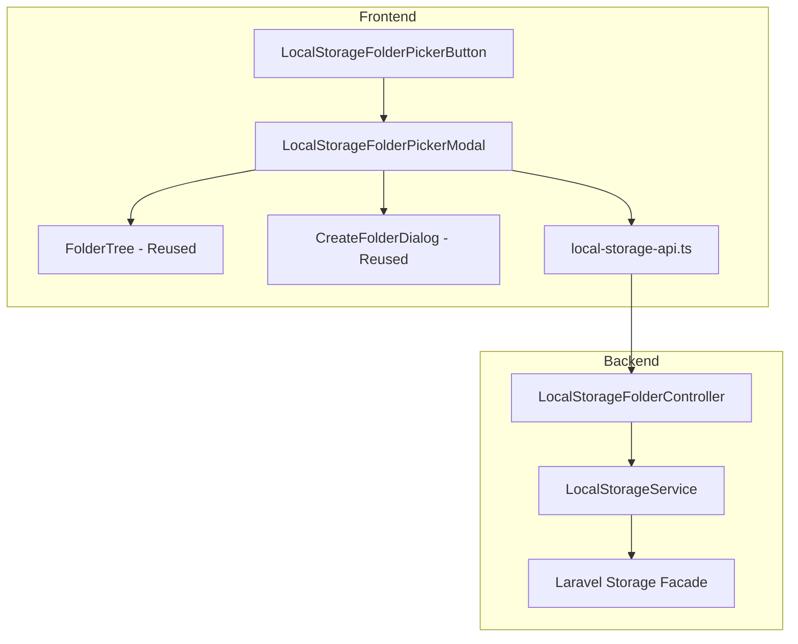

# Design Document: Local Storage Folder Picker

## Overview

This feature adds a folder picker UI for local storage connections, reusing the same component patterns established for Google Drive. The implementation consists of a backend API for folder operations and frontend components that mirror the Google Drive folder picker.

## Architecture



## Components and Interfaces

### Backend Components

#### 1. LocalStorageFolderController

New controller for local storage folder operations.

```php
<?php

namespace App\Http\Controllers;

use App\Services\LocalStorageService;
use Illuminate\Http\JsonResponse;
use Illuminate\Http\Request;

class LocalStorageFolderController extends Controller
{
    public function __construct(
        private LocalStorageService $storageService
    ) {}

    /**
     * List folders in a directory
     * GET /api/local-storage/folders?disk=local&path=
     */
    public function index(Request $request): JsonResponse
    {
        $request->validate([
            'disk' => 'required|string|in:local,public',
            'path' => 'nullable|string|max:500',
        ]);

        $disk = $request->query('disk', 'local');
        $path = $request->query('path', '');

        try {
            $folders = $this->storageService->listFolders($disk, $path);
            return response()->json(['folders' => $folders]);
        } catch (\Exception $e) {
            return response()->json(['error' => $e->getMessage()], 500);
        }
    }

    /**
     * Create a new folder
     * POST /api/local-storage/folders
     */
    public function store(Request $request): JsonResponse
    {
        $request->validate([
            'disk' => 'required|string|in:local,public',
            'path' => 'nullable|string|max:500',
            'name' => 'required|string|max:255|regex:/^[a-zA-Z0-9_\-\s\.]+$/',
        ]);

        $disk = $request->input('disk', 'local');
        $parentPath = $request->input('path', '');
        $name = $request->input('name');

        try {
            $folder = $this->storageService->createFolder($disk, $parentPath, $name);
            return response()->json(['folder' => $folder], 201);
        } catch (\Exception $e) {
            return response()->json(['error' => $e->getMessage()], 500);
        }
    }
}
```

#### 2. LocalStorageService

Service class for folder operations.

```php
<?php

namespace App\Services;

use Illuminate\Support\Facades\Storage;

class LocalStorageService
{
    /**
     * List folders in a directory
     */
    public function listFolders(string $disk, string $path = ''): array
    {
        $this->validateDisk($disk);
        $path = $this->sanitizePath($path);
        
        $diskInstance = Storage::disk($disk);
        $directories = $diskInstance->directories($path);
        
        $folders = [];
        foreach ($directories as $dir) {
            $name = basename($dir);
            
            // Skip hidden directories
            if (str_starts_with($name, '.')) {
                continue;
            }
            
            $hasChildren = count($diskInstance->directories($dir)) > 0;
            
            $folders[] = [
                'id' => $dir, // Use path as ID
                'name' => $name,
                'path' => '/' . $dir,
                'parentPath' => $path ?: null,
                'hasChildren' => $hasChildren,
            ];
        }
        
        // Sort alphabetically
        usort($folders, fn($a, $b) => strcasecmp($a['name'], $b['name']));
        
        return $folders;
    }

    /**
     * Create a new folder
     */
    public function createFolder(string $disk, string $parentPath, string $name): array
    {
        $this->validateDisk($disk);
        $parentPath = $this->sanitizePath($parentPath);
        $name = $this->sanitizeFolderName($name);
        
        $fullPath = $parentPath ? "{$parentPath}/{$name}" : $name;
        
        $diskInstance = Storage::disk($disk);
        
        if ($diskInstance->exists($fullPath)) {
            throw new \RuntimeException("Folder '{$name}' already exists");
        }
        
        $diskInstance->makeDirectory($fullPath);
        
        return [
            'id' => $fullPath,
            'name' => $name,
            'path' => '/' . $fullPath,
            'parentPath' => $parentPath ?: null,
            'hasChildren' => false,
        ];
    }

    /**
     * Validate disk is allowed
     */
    private function validateDisk(string $disk): void
    {
        $allowedDisks = ['local', 'public'];
        if (!in_array($disk, $allowedDisks)) {
            throw new \InvalidArgumentException("Invalid storage disk: {$disk}");
        }
        
        if (!config("filesystems.disks.{$disk}")) {
            throw new \InvalidArgumentException("Storage disk '{$disk}' is not configured");
        }
    }

    /**
     * Sanitize path to prevent traversal attacks
     */
    private function sanitizePath(string $path): string
    {
        // Remove leading/trailing slashes
        $path = trim($path, '/');
        
        // Reject path traversal attempts
        if (str_contains($path, '..') || str_contains($path, './')) {
            throw new \InvalidArgumentException('Invalid path');
        }
        
        // Remove any null bytes
        $path = str_replace("\0", '', $path);
        
        return $path;
    }

    /**
     * Sanitize folder name
     */
    private function sanitizeFolderName(string $name): string
    {
        $name = trim($name);
        
        // Only allow alphanumeric, spaces, underscores, hyphens, dots
        if (!preg_match('/^[a-zA-Z0-9_\-\s\.]+$/', $name)) {
            throw new \InvalidArgumentException('Folder name contains invalid characters');
        }
        
        // Prevent hidden folders
        if (str_starts_with($name, '.')) {
            throw new \InvalidArgumentException('Folder name cannot start with a dot');
        }
        
        return $name;
    }
}
```

### Frontend Components

#### 1. LocalStorageFolder Type

```typescript
// resources/js/types/local-storage.ts
export interface LocalStorageFolder {
  id: string;           // Path used as unique ID
  name: string;
  path: string;         // Full path from disk root
  parentPath: string | null;
  hasChildren: boolean;
  children?: LocalStorageFolder[];
  isLoading?: boolean;
  isExpanded?: boolean;
}

export interface FolderListResponse {
  folders: LocalStorageFolder[];
}

export interface FolderResponse {
  folder: LocalStorageFolder;
}

export interface FolderErrorResponse {
  error: string;
}
```

#### 2. Local Storage API Service

```typescript
// resources/js/services/local-storage-api.ts
import type {
  LocalStorageFolder,
  FolderListResponse,
  FolderResponse,
} from '@/types/local-storage';

const API_BASE = '/api/local-storage/folders';

async function handleResponse<T>(response: Response): Promise<T> {
  if (!response.ok) {
    const error = await response.json();
    throw new Error(error.error || 'An error occurred');
  }
  return response.json();
}

export async function listFolders(
  disk: string,
  path?: string
): Promise<LocalStorageFolder[]> {
  const params = new URLSearchParams({ disk });
  if (path) params.set('path', path);
  
  const response = await fetch(`${API_BASE}?${params}`, {
    headers: {
      Accept: 'application/json',
      'X-Requested-With': 'XMLHttpRequest',
    },
    credentials: 'same-origin',
  });

  const data = await handleResponse<FolderListResponse>(response);
  return data.folders;
}

export async function createFolder(
  disk: string,
  name: string,
  parentPath?: string
): Promise<LocalStorageFolder> {
  const csrfToken = document.querySelector('meta[name="csrf-token"]')?.getAttribute('content') || '';
  
  const response = await fetch(API_BASE, {
    method: 'POST',
    headers: {
      'Content-Type': 'application/json',
      Accept: 'application/json',
      'X-Requested-With': 'XMLHttpRequest',
      'X-CSRF-TOKEN': csrfToken,
    },
    credentials: 'same-origin',
    body: JSON.stringify({
      disk,
      name,
      path: parentPath || '',
    }),
  });

  const data = await handleResponse<FolderResponse>(response);
  return data.folder;
}
```

#### 3. LocalStorageFolderPickerButton

```typescript
// resources/js/components/connections/LocalStorageFolderPickerButton.tsx
import { useState } from 'react';
import { FolderSearch } from 'lucide-react';
import { Button } from '@/components/ui/button';
import { LocalStorageFolderPickerModal } from './LocalStorageFolderPickerModal';
import type { LocalStorageFolder } from '@/types/local-storage';

interface Props {
  disk: string;
  onFolderSelect: (folder: LocalStorageFolder | null) => void;
  currentPath?: string;
  disabled?: boolean;
}

export function LocalStorageFolderPickerButton({
  disk,
  onFolderSelect,
  currentPath,
  disabled,
}: Props) {
  const [modalOpen, setModalOpen] = useState(false);

  return (
    <>
      <Button
        type="button"
        variant="outline"
        onClick={() => setModalOpen(true)}
        disabled={disabled}
        className="gap-2"
      >
        <FolderSearch className="h-4 w-4" />
        Browse
      </Button>

      <LocalStorageFolderPickerModal
        open={modalOpen}
        onClose={() => setModalOpen(false)}
        onSelect={onFolderSelect}
        disk={disk}
        currentPath={currentPath}
      />
    </>
  );
}
```

#### 4. LocalStorageFolderPickerModal

```typescript
// resources/js/components/connections/LocalStorageFolderPickerModal.tsx
import { useState, useEffect, useCallback } from 'react';
import { FolderPlus, RefreshCw, Home, CheckCircle2 } from 'lucide-react';
import {
  Dialog,
  DialogContent,
  DialogDescription,
  DialogFooter,
  DialogHeader,
  DialogTitle,
} from '@/components/ui/dialog';
import { Button } from '@/components/ui/button';
import { FolderTree } from './FolderTree';
import { CreateFolderDialog } from './CreateFolderDialog';
import { FolderTreeSkeleton } from './FolderTreeSkeleton';
import { listFolders, createFolder } from '@/services/local-storage-api';
import type { LocalStorageFolder } from '@/types/local-storage';

interface Props {
  open: boolean;
  onClose: () => void;
  onSelect: (folder: LocalStorageFolder | null) => void;
  disk: string;
  currentPath?: string;
}

export function LocalStorageFolderPickerModal({
  open,
  onClose,
  onSelect,
  disk,
  currentPath,
}: Props) {
  const [folders, setFolders] = useState<LocalStorageFolder[]>([]);
  const [selectedFolder, setSelectedFolder] = useState<LocalStorageFolder | null>(null);
  const [loading, setLoading] = useState(false);
  const [error, setError] = useState<string | null>(null);
  const [createDialogOpen, setCreateDialogOpen] = useState(false);
  const [createLoading, setCreateLoading] = useState(false);
  const [createError, setCreateError] = useState<string | null>(null);
  const [successMessage, setSuccessMessage] = useState<string | null>(null);

  const diskLabel = disk === 'local' ? 'storage/app' : 'storage/app/public';

  const loadRootFolders = useCallback(async () => {
    setLoading(true);
    setError(null);
    try {
      const rootFolders = await listFolders(disk);
      setFolders(rootFolders);
    } catch (err) {
      setError(err instanceof Error ? err.message : 'Failed to load folders');
    } finally {
      setLoading(false);
    }
  }, [disk]);

  useEffect(() => {
    if (open) {
      loadRootFolders();
      setSelectedFolder(null);
    }
  }, [open, loadRootFolders]);

  const handleExpand = useCallback(async (folder: LocalStorageFolder) => {
    if (folder.isExpanded) {
      setFolders((prev) =>
        updateFolderInTree(prev, folder.id, { isExpanded: false })
      );
      return;
    }

    setFolders((prev) =>
      updateFolderInTree(prev, folder.id, { isLoading: true, isExpanded: true })
    );

    try {
      const children = await listFolders(disk, folder.id);
      setFolders((prev) =>
        updateFolderInTree(prev, folder.id, { children, isLoading: false })
      );
    } catch (err) {
      setFolders((prev) =>
        updateFolderInTree(prev, folder.id, { isLoading: false, isExpanded: false })
      );
    }
  }, [disk]);

  const handleCreateFolder = useCallback(async (name: string) => {
    setCreateLoading(true);
    setCreateError(null);
    try {
      const parentPath = selectedFolder?.id || '';
      const newFolder = await createFolder(disk, name, parentPath);
      
      if (parentPath) {
        setFolders((prev) =>
          updateFolderInTree(prev, parentPath, {
            children: [...(findFolderInTree(prev, parentPath)?.children || []), newFolder],
            hasChildren: true,
            isExpanded: true,
          })
        );
      } else {
        setFolders((prev) => [...prev, newFolder]);
      }
      
      setSelectedFolder(newFolder);
      setCreateDialogOpen(false);
      setSuccessMessage(`Folder "${name}" created successfully`);
      setTimeout(() => setSuccessMessage(null), 3000);
    } catch (err) {
      setCreateError(err instanceof Error ? err.message : 'Failed to create folder');
    } finally {
      setCreateLoading(false);
    }
  }, [disk, selectedFolder]);

  const handleConfirm = () => {
    onSelect(selectedFolder);
    onClose();
  };

  const handleSelectRoot = () => {
    setSelectedFolder(null);
  };

  // Adapter to convert LocalStorageFolder to GoogleDriveFolder format for FolderTree
  const adaptedFolders = folders.map(adaptFolder);

  return (
    <>
      <Dialog open={open} onOpenChange={onClose}>
        <DialogContent className="max-h-[80vh] sm:max-w-lg">
          <DialogHeader>
            <DialogTitle>Select Storage Folder</DialogTitle>
            <DialogDescription>
              Browsing: {diskLabel}
            </DialogDescription>
          </DialogHeader>

          <div className="space-y-4">
            <div className="flex items-center gap-2">
              <Button
                type="button"
                variant={selectedFolder === null ? 'secondary' : 'outline'}
                size="sm"
                onClick={handleSelectRoot}
                className="gap-1"
              >
                <Home className="h-3 w-3" />
                Root
              </Button>
              <Button
                type="button"
                variant="outline"
                size="sm"
                onClick={() => setCreateDialogOpen(true)}
                className="gap-1"
              >
                <FolderPlus className="h-3 w-3" />
                New Folder
              </Button>
              <Button
                type="button"
                variant="ghost"
                size="sm"
                onClick={loadRootFolders}
                disabled={loading}
                className="ml-auto gap-1"
              >
                <RefreshCw className={`h-3 w-3 ${loading ? 'animate-spin' : ''}`} />
                Refresh
              </Button>
            </div>

            <div className="max-h-[300px] min-h-[200px] overflow-y-auto rounded-md border p-2">
              {loading ? (
                <FolderTreeSkeleton count={6} />
              ) : error ? (
                <div className="flex h-[200px] flex-col items-center justify-center gap-2 text-center px-4">
                  <p className="text-sm text-destructive">{error}</p>
                  <Button variant="outline" size="sm" onClick={loadRootFolders}>
                    Retry
                  </Button>
                </div>
              ) : folders.length === 0 ? (
                <div className="flex h-[200px] flex-col items-center justify-center gap-2 text-center px-4">
                  <p className="text-sm text-muted-foreground">
                    No folders found. Create one to get started.
                  </p>
                  <Button
                    variant="outline"
                    size="sm"
                    onClick={() => setCreateDialogOpen(true)}
                    className="gap-1"
                  >
                    <FolderPlus className="h-3 w-3" />
                    Create a folder
                  </Button>
                </div>
              ) : (
                <FolderTree
                  folders={adaptedFolders}
                  selectedFolderId={selectedFolder?.id ?? null}
                  currentFolderId={currentPath}
                  onSelect={(f) => setSelectedFolder(unadaptFolder(f))}
                  onExpand={(f) => handleExpand(unadaptFolder(f))}
                />
              )}
            </div>

            {successMessage && (
              <div className="flex items-center gap-2 rounded-md bg-green-50 p-2 text-sm text-green-700 dark:bg-green-950/20 dark:text-green-400">
                <CheckCircle2 className="h-4 w-4" />
                {successMessage}
              </div>
            )}

            {selectedFolder && (
              <p className="text-sm text-muted-foreground">
                Selected: <span className="font-medium">{selectedFolder.path}</span>
              </p>
            )}
          </div>

          <DialogFooter>
            <Button type="button" variant="outline" onClick={onClose}>
              Cancel
            </Button>
            <Button type="button" onClick={handleConfirm}>
              {selectedFolder ? 'Select Folder' : 'Use Root'}
            </Button>
          </DialogFooter>
        </DialogContent>
      </Dialog>

      <CreateFolderDialog
        open={createDialogOpen}
        onClose={() => setCreateDialogOpen(false)}
        onCreate={handleCreateFolder}
        parentFolder={selectedFolder ? { id: selectedFolder.id, name: selectedFolder.name } : null}
        loading={createLoading}
        error={createError}
      />
    </>
  );
}

// Helper functions
function updateFolderInTree(
  folders: LocalStorageFolder[],
  folderId: string,
  updates: Partial<LocalStorageFolder>
): LocalStorageFolder[] {
  return folders.map((folder) => {
    if (folder.id === folderId) {
      return { ...folder, ...updates };
    }
    if (folder.children) {
      return {
        ...folder,
        children: updateFolderInTree(folder.children, folderId, updates),
      };
    }
    return folder;
  });
}

function findFolderInTree(
  folders: LocalStorageFolder[],
  folderId: string
): LocalStorageFolder | null {
  for (const folder of folders) {
    if (folder.id === folderId) return folder;
    if (folder.children) {
      const found = findFolderInTree(folder.children, folderId);
      if (found) return found;
    }
  }
  return null;
}

// Adapters to reuse FolderTree component (expects GoogleDriveFolder shape)
function adaptFolder(folder: LocalStorageFolder): any {
  return {
    ...folder,
    parentId: folder.parentPath,
    mimeType: 'folder',
    createdTime: '',
    modifiedTime: '',
    children: folder.children?.map(adaptFolder),
  };
}

function unadaptFolder(folder: any): LocalStorageFolder {
  return {
    id: folder.id,
    name: folder.name,
    path: folder.path,
    parentPath: folder.parentId,
    hasChildren: folder.hasChildren,
    children: folder.children?.map(unadaptFolder),
    isLoading: folder.isLoading,
    isExpanded: folder.isExpanded,
  };
}
```

### Routes

Add to `routes/web.php`:

```php
// Local Storage Folder API
Route::middleware(['auth'])->prefix('api/local-storage')->group(function () {
    Route::get('/folders', [LocalStorageFolderController::class, 'index']);
    Route::post('/folders', [LocalStorageFolderController::class, 'store']);
});
```

## Data Models

### Folder Response Structure

```json
{
  "folders": [
    {
      "id": "backups",
      "name": "backups",
      "path": "/backups",
      "parentPath": null,
      "hasChildren": true
    },
    {
      "id": "backups/mongodb",
      "name": "mongodb",
      "path": "/backups/mongodb",
      "parentPath": "backups",
      "hasChildren": false
    }
  ]
}
```

## Error Handling

| Error | HTTP Status | Message |
|-------|-------------|---------|
| Invalid disk | 400 | "Invalid storage disk: {disk}" |
| Path traversal | 400 | "Invalid path" |
| Invalid folder name | 400 | "Folder name contains invalid characters" |
| Folder exists | 400 | "Folder '{name}' already exists" |
| Permission denied | 500 | "Failed to create folder: Permission denied" |
| Disk not configured | 500 | "Storage disk '{disk}' is not configured" |

## Testing Strategy

### Unit Tests
- LocalStorageService path sanitization
- LocalStorageService folder name validation
- Controller request validation

### Integration Tests
- List folders API endpoint
- Create folder API endpoint
- Path traversal prevention

### Frontend Tests
- Modal open/close behavior
- Folder selection updates form
- Create folder flow
- Error state display
