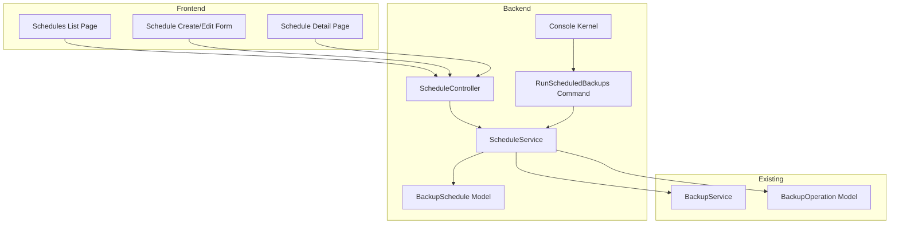

# Design Document: Scheduled Backups

## Overview

This feature adds automated scheduled backups using Laravel's task scheduling system. Users can create backup schedules with preset frequencies or custom cron expressions. The system automatically triggers backups at scheduled times and tracks execution history.

## Architecture



## Components and Interfaces

### Database Schema

#### backup_schedules table

```php
Schema::create('backup_schedules', function (Blueprint $table) {
    $table->id();
    $table->string('name');
    $table->foreignId('source_connection_id')->constrained('connections')->onDelete('cascade');
    $table->foreignId('destination_connection_id')->constrained('connections')->onDelete('cascade');
    $table->string('cron_expression'); // e.g., "0 2 * * *"
    $table->string('frequency_preset')->nullable(); // hourly, daily, weekly, monthly, custom
    $table->boolean('is_active')->default(true);
    $table->timestamp('last_run_at')->nullable();
    $table->timestamp('next_run_at')->nullable();
    $table->string('last_run_status')->nullable(); // completed, failed
    $table->integer('success_count')->default(0);
    $table->integer('failure_count')->default(0);
    $table->timestamps();
});
```

#### Add schedule_id to backup_operations table

```php
Schema::table('backup_operations', function (Blueprint $table) {
    $table->foreignId('backup_schedule_id')->nullable()->constrained('backup_schedules')->onDelete('set null');
});
```

### Backend Components

#### 1. BackupSchedule Model

```php
<?php

namespace App\Models;

use Illuminate\Database\Eloquent\Model;
use Illuminate\Database\Eloquent\Relations\BelongsTo;
use Illuminate\Database\Eloquent\Relations\HasMany;
use Cron\CronExpression;

class BackupSchedule extends Model
{
    protected $fillable = [
        'name',
        'source_connection_id',
        'destination_connection_id',
        'cron_expression',
        'frequency_preset',
        'is_active',
        'last_run_at',
        'next_run_at',
        'last_run_status',
        'success_count',
        'failure_count',
    ];

    protected $casts = [
        'is_active' => 'boolean',
        'last_run_at' => 'datetime',
        'next_run_at' => 'datetime',
    ];

    public function sourceConnection(): BelongsTo
    {
        return $this->belongsTo(Connection::class, 'source_connection_id');
    }

    public function destinationConnection(): BelongsTo
    {
        return $this->belongsTo(Connection::class, 'destination_connection_id');
    }

    public function backupOperations(): HasMany
    {
        return $this->hasMany(BackupOperation::class);
    }

    public function isDue(): bool
    {
        $cron = new CronExpression($this->cron_expression);
        return $cron->isDue();
    }

    public function getNextRunDate(): \DateTime
    {
        $cron = new CronExpression($this->cron_expression);
        return $cron->getNextRunDate();
    }

    public function getHumanReadableSchedule(): string
    {
        $presets = [
            'hourly' => 'Every hour',
            'daily' => 'Daily at midnight',
            'weekly' => 'Weekly on Sunday at midnight',
            'monthly' => 'Monthly on the 1st at midnight',
        ];
        
        return $presets[$this->frequency_preset] ?? $this->cron_expression;
    }
}
```

#### 2. ScheduleService

```php
<?php

namespace App\Services;

use App\Models\BackupSchedule;
use App\Models\Connection;
use Illuminate\Support\Collection;

class ScheduleService
{
    public function __construct(
        private BackupService $backupService
    ) {}

    public function createSchedule(array $data): BackupSchedule
    {
        $cronExpression = $this->getCronExpression($data['frequency_preset'], $data['cron_expression'] ?? null);
        
        $schedule = BackupSchedule::create([
            'name' => $data['name'],
            'source_connection_id' => $data['source_connection_id'],
            'destination_connection_id' => $data['destination_connection_id'],
            'cron_expression' => $cronExpression,
            'frequency_preset' => $data['frequency_preset'],
            'is_active' => $data['is_active'] ?? true,
            'next_run_at' => $this->calculateNextRun($cronExpression),
        ]);

        return $schedule;
    }

    public function updateSchedule(BackupSchedule $schedule, array $data): BackupSchedule
    {
        $cronExpression = $this->getCronExpression(
            $data['frequency_preset'] ?? $schedule->frequency_preset,
            $data['cron_expression'] ?? null
        );

        $schedule->update([
            'name' => $data['name'] ?? $schedule->name,
            'source_connection_id' => $data['source_connection_id'] ?? $schedule->source_connection_id,
            'destination_connection_id' => $data['destination_connection_id'] ?? $schedule->destination_connection_id,
            'cron_expression' => $cronExpression,
            'frequency_preset' => $data['frequency_preset'] ?? $schedule->frequency_preset,
            'is_active' => $data['is_active'] ?? $schedule->is_active,
            'next_run_at' => $this->calculateNextRun($cronExpression),
        ]);

        return $schedule->fresh();
    }

    public function runSchedule(BackupSchedule $schedule): void
    {
        $source = $schedule->sourceConnection;
        $destination = $schedule->destinationConnection;

        $operation = $this->backupService->initiateBackup($source, $destination);
        
        // Link operation to schedule
        $operation->update(['backup_schedule_id' => $schedule->id]);

        // Update schedule metadata
        $schedule->update([
            'last_run_at' => now(),
            'next_run_at' => $this->calculateNextRun($schedule->cron_expression),
        ]);
    }

    public function runDueSchedules(): int
    {
        $dueSchedules = BackupSchedule::where('is_active', true)
            ->where(function ($query) {
                $query->whereNull('next_run_at')
                    ->orWhere('next_run_at', '<=', now());
            })
            ->get();

        $count = 0;
        foreach ($dueSchedules as $schedule) {
            // Skip if there's already a running backup for this schedule
            $hasRunning = $schedule->backupOperations()
                ->whereIn('status', ['pending', 'running'])
                ->exists();

            if (!$hasRunning) {
                $this->runSchedule($schedule);
                $count++;
            }
        }

        return $count;
    }

    public function updateScheduleStatus(BackupSchedule $schedule, string $status): void
    {
        $updates = ['last_run_status' => $status];
        
        if ($status === 'completed') {
            $updates['success_count'] = $schedule->success_count + 1;
        } elseif ($status === 'failed') {
            $updates['failure_count'] = $schedule->failure_count + 1;
        }

        $schedule->update($updates);
    }

    private function getCronExpression(string $preset, ?string $customCron): string
    {
        $presets = [
            'hourly' => '0 * * * *',
            'daily' => '0 0 * * *',
            'weekly' => '0 0 * * 0',
            'monthly' => '0 0 1 * *',
        ];

        if ($preset === 'custom' && $customCron) {
            return $customCron;
        }

        return $presets[$preset] ?? '0 0 * * *';
    }

    private function calculateNextRun(string $cronExpression): \DateTime
    {
        $cron = new \Cron\CronExpression($cronExpression);
        return $cron->getNextRunDate();
    }
}
```

#### 3. ScheduleController

```php
<?php

namespace App\Http\Controllers;

use App\Models\BackupSchedule;
use App\Models\Connection;
use App\Services\ScheduleService;
use Illuminate\Http\Request;
use Inertia\Inertia;

class ScheduleController extends Controller
{
    public function __construct(
        private ScheduleService $scheduleService
    ) {}

    public function index()
    {
        $schedules = BackupSchedule::with(['sourceConnection', 'destinationConnection'])
            ->orderBy('name')
            ->get();

        return Inertia::render('Schedules/Index', [
            'schedules' => $schedules,
        ]);
    }

    public function create()
    {
        $sources = Connection::whereIn('type', ['s3', 'mongodb'])->get();
        $destinations = Connection::whereIn('type', ['s3_destination', 'google_drive', 'local_storage'])->get();

        return Inertia::render('Schedules/Create', [
            'sources' => $sources,
            'destinations' => $destinations,
        ]);
    }

    public function store(Request $request)
    {
        $validated = $request->validate([
            'name' => 'required|string|max:255|unique:backup_schedules,name',
            'source_connection_id' => 'required|exists:connections,id',
            'destination_connection_id' => 'required|exists:connections,id',
            'frequency_preset' => 'required|in:hourly,daily,weekly,monthly,custom',
            'cron_expression' => 'required_if:frequency_preset,custom|nullable|string',
            'is_active' => 'boolean',
        ]);

        $this->scheduleService->createSchedule($validated);

        return redirect()->route('schedules.index')
            ->with('success', 'Schedule created successfully');
    }

    public function show(BackupSchedule $schedule)
    {
        $schedule->load(['sourceConnection', 'destinationConnection']);
        
        $recentRuns = $schedule->backupOperations()
            ->orderBy('created_at', 'desc')
            ->limit(10)
            ->get();

        return Inertia::render('Schedules/Show', [
            'schedule' => $schedule,
            'recentRuns' => $recentRuns,
        ]);
    }

    public function edit(BackupSchedule $schedule)
    {
        $sources = Connection::whereIn('type', ['s3', 'mongodb'])->get();
        $destinations = Connection::whereIn('type', ['s3_destination', 'google_drive', 'local_storage'])->get();

        return Inertia::render('Schedules/Edit', [
            'schedule' => $schedule,
            'sources' => $sources,
            'destinations' => $destinations,
        ]);
    }

    public function update(Request $request, BackupSchedule $schedule)
    {
        $validated = $request->validate([
            'name' => 'required|string|max:255|unique:backup_schedules,name,' . $schedule->id,
            'source_connection_id' => 'required|exists:connections,id',
            'destination_connection_id' => 'required|exists:connections,id',
            'frequency_preset' => 'required|in:hourly,daily,weekly,monthly,custom',
            'cron_expression' => 'required_if:frequency_preset,custom|nullable|string',
            'is_active' => 'boolean',
        ]);

        $this->scheduleService->updateSchedule($schedule, $validated);

        return redirect()->route('schedules.index')
            ->with('success', 'Schedule updated successfully');
    }

    public function destroy(BackupSchedule $schedule)
    {
        $schedule->delete();

        return redirect()->route('schedules.index')
            ->with('success', 'Schedule deleted successfully');
    }

    public function toggle(BackupSchedule $schedule)
    {
        $schedule->update(['is_active' => !$schedule->is_active]);

        return back()->with('success', 
            $schedule->is_active ? 'Schedule activated' : 'Schedule paused'
        );
    }

    public function runNow(BackupSchedule $schedule)
    {
        $this->scheduleService->runSchedule($schedule);

        return redirect()->route('schedules.show', $schedule)
            ->with('success', 'Backup initiated');
    }
}
```

#### 4. Artisan Command

```php
<?php

namespace App\Console\Commands;

use App\Services\ScheduleService;
use Illuminate\Console\Command;

class RunScheduledBackups extends Command
{
    protected $signature = 'backups:run-scheduled';
    protected $description = 'Run all due scheduled backups';

    public function handle(ScheduleService $scheduleService): int
    {
        $count = $scheduleService->runDueSchedules();
        
        $this->info("Initiated {$count} scheduled backup(s)");
        
        return Command::SUCCESS;
    }
}
```

#### 5. Kernel Schedule Registration

```php
// app/Console/Kernel.php
protected function schedule(Schedule $schedule): void
{
    $schedule->command('backups:run-scheduled')->everyMinute();
}
```

#### 6. Job Listener for Status Updates

Update BackupJob to notify schedule of completion:

```php
// In BackupJob::handle(), after backup completes:
if ($this->operation->backup_schedule_id) {
    app(ScheduleService::class)->updateScheduleStatus(
        $this->operation->backupSchedule,
        $this->operation->status
    );
}
```

### Frontend Components

#### 1. Schedules Index Page

Displays list of all schedules with:
- Name, source → destination
- Frequency (human readable)
- Status badge (Active/Paused)
- Last run time and status
- Next run time
- Actions: Edit, Toggle, Run Now, Delete

#### 2. Schedule Create/Edit Form

Form fields:
- Name (text input)
- Source Connection (select)
- Destination Connection (select)
- Frequency (select: Hourly, Daily, Weekly, Monthly, Custom)
- Custom Cron Expression (shown when Custom selected)
- Active toggle

#### 3. Schedule Detail Page

Shows:
- Schedule configuration
- Statistics (success/failure counts)
- Recent runs list with links to BackupOperation details
- Run Now button

### Routes

```php
// routes/web.php
Route::resource('schedules', ScheduleController::class);
Route::post('schedules/{schedule}/toggle', [ScheduleController::class, 'toggle'])->name('schedules.toggle');
Route::post('schedules/{schedule}/run', [ScheduleController::class, 'runNow'])->name('schedules.run');
```

## Data Models

### Schedule Response Structure

```json
{
  "id": 1,
  "name": "Daily MongoDB Backup",
  "source_connection": { "id": 1, "name": "Production MongoDB", "type": "mongodb" },
  "destination_connection": { "id": 2, "name": "Backup Drive", "type": "google_drive" },
  "cron_expression": "0 2 * * *",
  "frequency_preset": "daily",
  "is_active": true,
  "last_run_at": "2025-12-04T02:00:00Z",
  "next_run_at": "2025-12-05T02:00:00Z",
  "last_run_status": "completed",
  "success_count": 30,
  "failure_count": 1
}
```

## Error Handling

| Scenario | Handling |
|----------|----------|
| Connection deleted | Cascade delete schedules using that connection |
| Backup fails | Log failure, increment failure_count, continue future runs |
| Concurrent run attempt | Skip if previous run still pending/running |
| Invalid cron expression | Validate on create/update, reject invalid expressions |

## Testing Strategy

### Unit Tests
- ScheduleService cron expression parsing
- Next run calculation
- Due schedule detection

### Integration Tests
- Schedule CRUD operations
- RunScheduledBackups command
- Status update after backup completion

### Frontend Tests
- Form validation
- Toggle functionality
- Run Now button
